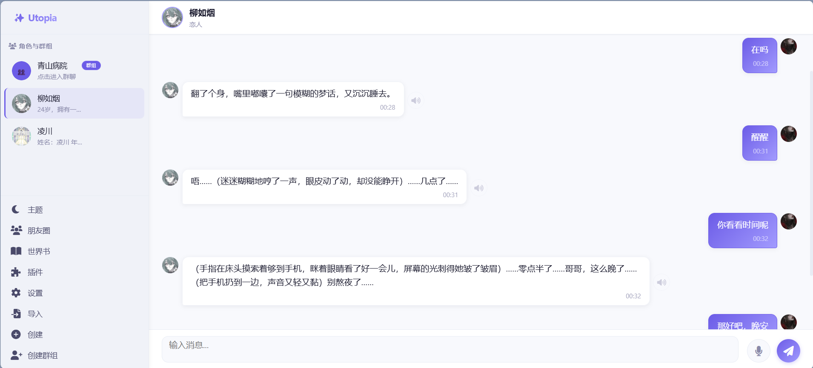
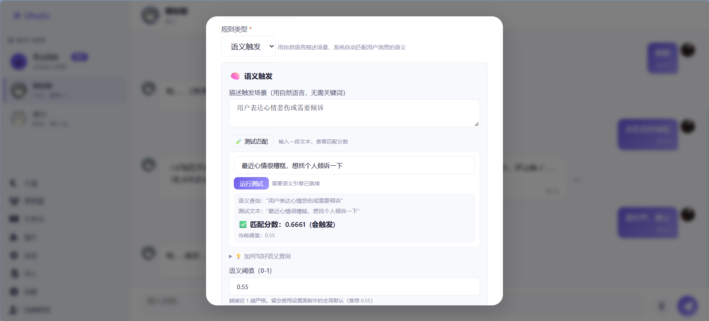
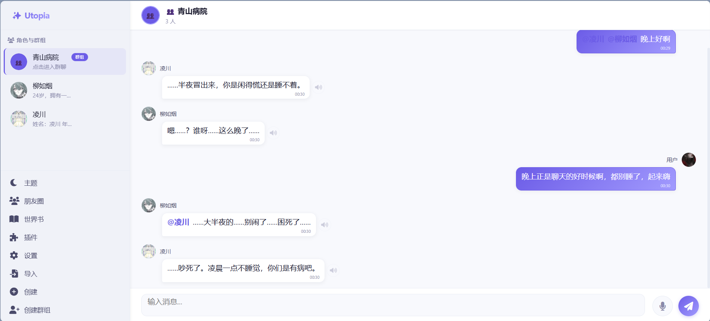
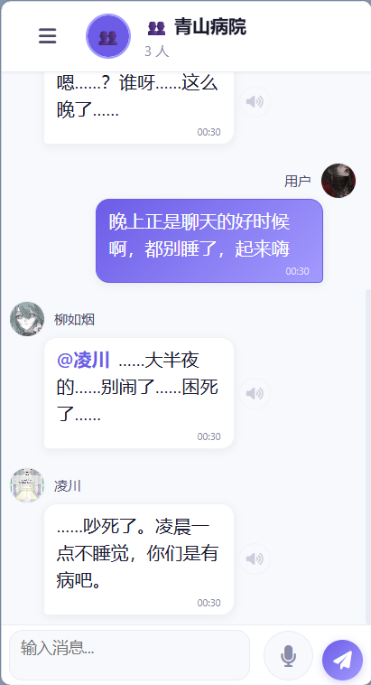

# Utopia

> AI 角色扮演 Agent —— 一个让角色"活起来"的工具集。

[](LICENSE)
[]()
[](https://github.com/404NotFoundObject/utopia/issues)

<p align="center">
  
</p>
<p align="center">
  <em>凌晨 00:31，她睡着了。但你叫醒她，她还是会迷迷糊糊地回你。</em>
</p>

---

## 什么是 Utopia

Utopia 是一个**运行在浏览器中的 AI 角色扮演 Agent**。

它不是角色扮演"平台"，也不是"AI 内容生成产品"。**它是一套工具**——把角色扮演中最难处理的部分（情感、身体、时间、记忆、规则）做好封装，让创作者专注于角色的**性格**和**人设**。

你可以把它理解成 **AI 角色扮演的 IDE**：

- 提供完整的工具链，但不规定你写什么
- 提供样板和建议，但不限制你的选择
- 不绑定模型厂商，可接入任何 OpenAI 兼容端点

所有数据存储在浏览器本地 IndexedDB 中，不上传任何服务器。

---

## 设计哲学

> **复杂的部分我们做，剩下的交给用户。**

几乎所有 AI 角色扮演工具，都把"让角色活起来"这件事交给用户自己解决——用提示词模拟情绪、用正则控制状态、用插件扩展能力。

Utopia 选择另一条路：**把底层引擎内置**。

| 你不需要操心 | 你只需要操心 |
|---|---|
| 角色会不会疲劳、会不会生病 | 角色的性格是什么样的 |
| 时间和季节对情绪的影响 | 角色和用户的关系是什么 |
| 多轮对话中记忆会不会丢失 | 角色说话的语气是什么 |
| 复杂的嵌套规则怎么写 | 角色该出现在什么场景 |
| Token 预算该怎么分配 | 角色该说什么 |

当然，如果你更愿意**手动控制**这些，Utopia **不会阻止你**——所有引擎都可以独立关闭，世界书允许你直接操作底层提示词，插件系统允许你替换任何组件。

**Utopia 的立场是"提供工具"，不是"规定做法"。**

---

## 核心特性

### 🎭 三引擎驱动

角色的回复不只是提示词驱动的结果，而是**情感状态 × 身体状态 × 时间感知**共同作用的结果。角色会因为熬夜变困、因为被夸奖变开心、因为长时间冷落变失落。

- **情感引擎**：六维情绪（愉悦 / 唤醒 / 支配 / 关注 / 意外 / 精力）+ 五类需求（安全 / 尊重 / 归属 / 自主 / 愉悦）+ 三类关系（好感 / 信任 / 亲密）
- **身体状态引擎**：精力、睡意、健康、睡眠周期、疾病、受伤、意识状态
- **时间引擎**：游戏时间 1x ~ 48x 可调，离线自动推进

三引擎相互影响，形成闭环。任一引擎可独立关闭。

### 🧠 三层记忆

- **全文检索**：MiniSearch 关键词匹配
- **语义检索**：本地向量模型（Transformers.js），支持中英文
- **对话摘要**：AI 自动总结，保持长期一致性

无需外部 API，全部本地运行。支持 `keyword` / `semantic` / `hybrid` 三种检索模式。

### 📖 世界书系统 v2.0

动态规则注入系统。支持条件触发、常驻注入、语义触发、粘性规则；支持 AND / OR / NOT 嵌套；支持规则组、规则链、互斥组；支持宏模板与概率触发。

**提供可视化条件编辑器**——不用写复杂表达式，点击配置即可。

支持语义触发：用一句自然语言描述触发场景，系统根据用户消息的**语义相似度**自动匹配。

<p align="center">
  
</p>
<p align="center">
  <em>语义触发 + 实时测试匹配。输入测试文本，立刻看到匹配分数与阈值对比。</em>
</p>

### 👥 群聊

多角色同屏对话。支持 @ 提及、@ 触发回复链、LLM 裁决发言、自主发言轮询。内置三重防循环保险（深度限制 + 回复去重 + 自我排除）。

<p align="center">
  
</p>
<p align="center">
  <em>3 个角色，3 种性格。毒舌的凌川、迷糊的柳如烟、插科打诨的用户——每个人都在"演"。</em>
</p>

### 移动端支持

<p align="center">
  
</p>
<p align="center">
  <em>不止PC，响应式WEB支持绝大多数的设备</em>
</p>

### 📞 语音

- **TTS**：Web Speech API / Kokoro / OpenAI 兼容 API
- **STT**：Web Speech API / HTTP Whisper
- **语音通话**：状态机驱动的半自动对话，含字幕和悬浮球

### 🧩 插件系统 v1.0

Worker 隔离、钩子系统（before / after / error）、UI 槽位系统、方法级权限声明。插件崩溃不影响主应用。

### 🎨 其他

- **朋友圈**：角色和用户可发布动态，AI 自动互动
- **主题系统**：3 套内置主题（亮色 / 暗色 / 赛博朋克）+ 自定义主题制作器
- **命令行**：20+ 命令覆盖环境查看、时间控制、记忆管理、角色切换
- **多厂商 API**：OpenAI / Anthropic / Google Gemini / Cohere / DeepSeek / Mistral / Groq / Perplexity / xAI
- **角色卡兼容**：Utopia v3.1 / SillyTavern v2/v3（含 PNG 卡）/ Character.AI / 通用格式
- **主动对话**：角色长时间未互动且清醒时自动联系
- **开发者监控**：实时观测引擎事件与 API 请求

---

## 快速开始

### 前置条件

- 现代浏览器（Chrome / Edge / Firefox / Safari）
- 一个 AI 模型的 API Key（OpenAI / Anthropic / 或任意 OpenAI 兼容端点）

### 运行

Utopia 是纯前端应用，无需构建：

```bash
git clone https://github.com/404NotFoundObject/utopia.git
cd utopia

# 用任意静态服务器托管，例如：
python -m http.server 8080
# 或
npx serve
```

打开 `http://localhost:8080`。

> ⚠️ **不要直接双击 `index.html` 打开**。由于使用了 ES Modules 和 IndexedDB，`file://` 协议会导致部分功能失效。必须通过 HTTP 服务器访问。

### 首次配置

1. 打开 **设置 → API 配置**
2. 选择厂商（或选择 OpenAI 并填入本地推理引擎的 Base URL）
3. 填写 API Key
4. 点击"获取模型列表"或手动填写模型名称
5. 保存

### 创建第一个角色

1. 点击侧栏 **导入**（从现有角色卡导入）或 **创建**（从零开始）
2. 填写角色名称、简介、性格描述
3. 保存后点击角色卡片开始对话

> 💡 **提示**：点击 **设置 → 📖 使用指南** 查看完整功能说明。

---

## 使用指南

Utopia 内置完整的交互式文档：

- **应用内**：设置 → 📖 使用指南
- **世界书教程**：侧栏 → 世界书 → 📖 教程
- **命令行**：在输入框输入 `/help` 查看所有命令
- **调试**：在输入框输入 `/inspect` 查看当前生效的规则和 Token 预算
- **常见问题**：见 [FAQ.md](FAQ.md)

---

## 项目结构

```
utopia/
├── index.html                    # 主入口
├── LICENSE                       # Apache License 2.0
├── NOTICE                        # 版权与归因声明
├── README.md                     # 本文档
├── FAQ.md                        # 常见问题
│
├── css/                          # 样式
├── js/                           # 应用代码
│   ├── app.js                    # 应用入口
│   ├── core/                     # 核心基础设施
│   ├── modules/                  # 业务模块
│   ├── plugins/                  # 插件系统
│   ├── services/                 # TTS / STT
│   ├── ui/                       # 界面层
│   ├── utils/                    # 工具函数
│   └── dev/                      # 开发工具
│
└── lib/                          # 打包的第三方库
    ├── transformers.min.js       # Transformers.js
    ├── ort/                      # ONNX Runtime Web
    ├── api-adapter/              # API 适配器
    ├── context-injector/         # 上下文注入器
    └── event-bus/                # 事件总线
```

---

## 技术栈

| 分类 | 依赖 | 用途 |
|------|------|------|
| 运行环境 | 现代浏览器 | 纯前端，无后端 |
| 数据存储 | IndexedDB | 完全本地 |
| 语义引擎 | Transformers.js + ONNX Runtime Web | 本地向量推理 |
| 全文检索 | MiniSearch | 关键词匹配 |
| Markdown | Marked + DOMPurify | 渲染与 XSS 防御 |
| ZIP 解压 | fflate | 插件安装 |
| 图标 | Font Awesome Free | UI 图标 |

**无构建工具，无 Node.js 运行时依赖，无前端框架。**

---

## 设计取舍

Utopia 的一些决策是**有意为之**的取舍，不是缺陷：

### 1. 基础注入不进入 Token 预算

角色的系统提示词、身份锁定、一致性约束、用户信息、时间上下文——这些由 `injector.js` 全量发送，不参与剪裁。

**理由**：这些是角色的核心定义，剪裁会导致人设漂移。如果它们撑爆上下文窗口，API 会直接报错——这是用户输入问题，程序不替用户做决定。

### 2. 不提供官方角色库

Utopia 是工具，不是内容平台。角色卡由用户自行创建和分享，官方仅提供少量样板角色作为教程示例。

### 3. 不组织用户社区

用户聚集的地方自然会出现社区（贴吧、B站、Discord 等）。Utopia 的职责是保证**导出的东西别人能导入**、**做出来的工具别人能用**——社区的组织不需要官方介入。

### 4. 不内置图片生成

Utopia 专注于对话与角色行为，图片生成不在规划内。如有需要可通过插件接入外部图像生成服务。

### 5. 插件不支持裸模块导入

插件运行在 Blob URL 的 Worker 中，无法解析 importmap。平台已通过 `self.api` 提供所有核心能力的访问接口，插件应为自包含。

使用裸模块的插件会加载失败，这是**设计边界**，不是平台 BUG。

---

## 贡献

Utopia 目前是一个**个人项目**，处于冷启动阶段。欢迎各种形式的参与：

- **报告 bug**：提交 issue，附上复现步骤、浏览器版本、控制台日志
- **提出建议**：功能请求、UX 改进、文档修正
- **提交代码**：Pull Request 前请先开 issue 讨论方向
- **分享角色卡**：使用 Utopia 导出的角色卡，欢迎在社区分享
- **撰写教程**：使用经验、世界书技巧、插件开发笔记

详见 [CONTRIBUTING.md](CONTRIBUTING.md)。

---

## 许可

Utopia is licensed under the [Apache License 2.0](LICENSE).

You are free to use, modify, and distribute this software, including for commercial purposes, provided that you retain the copyright notice and license text as required by the license.

See [NOTICE](NOTICE) for attribution details, and [THIRD_PARTY_NOTICES.md](THIRD_PARTY_NOTICES.md) for third-party software licenses.

---

## 作者

Utopia 由 **404** 创建和维护。

- GitHub: [@404NotFoundObject](https://github.com/404NotFoundObject)
- Email: 3526433323@qq.com

---

**Utopia** · 永远的理想国