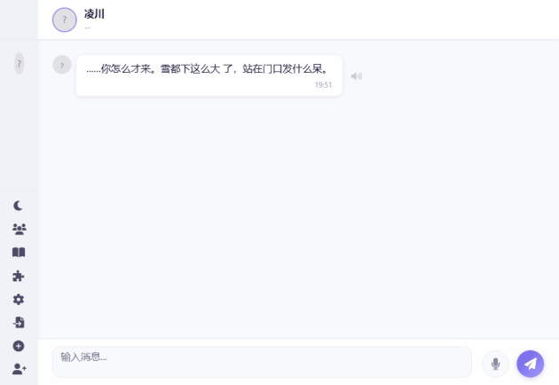
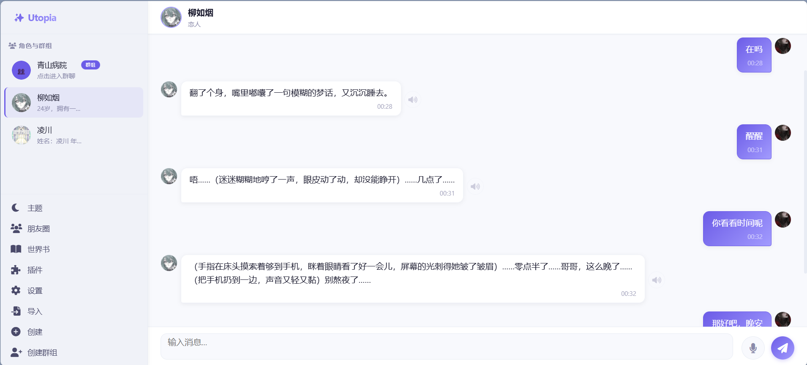
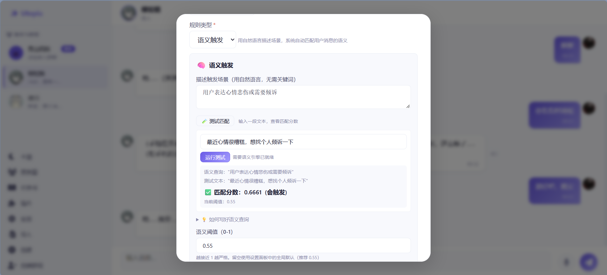
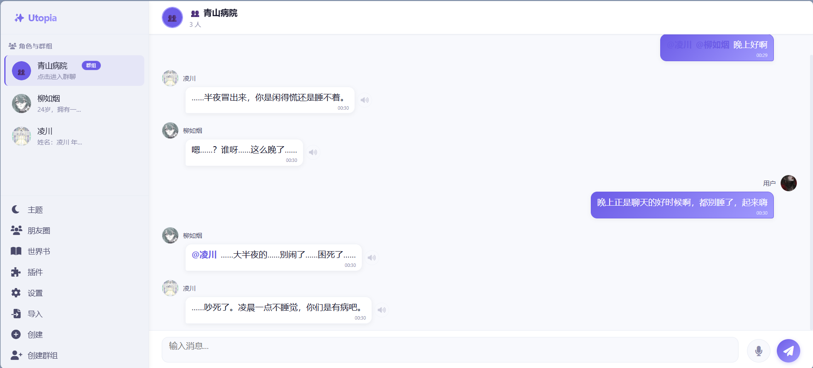
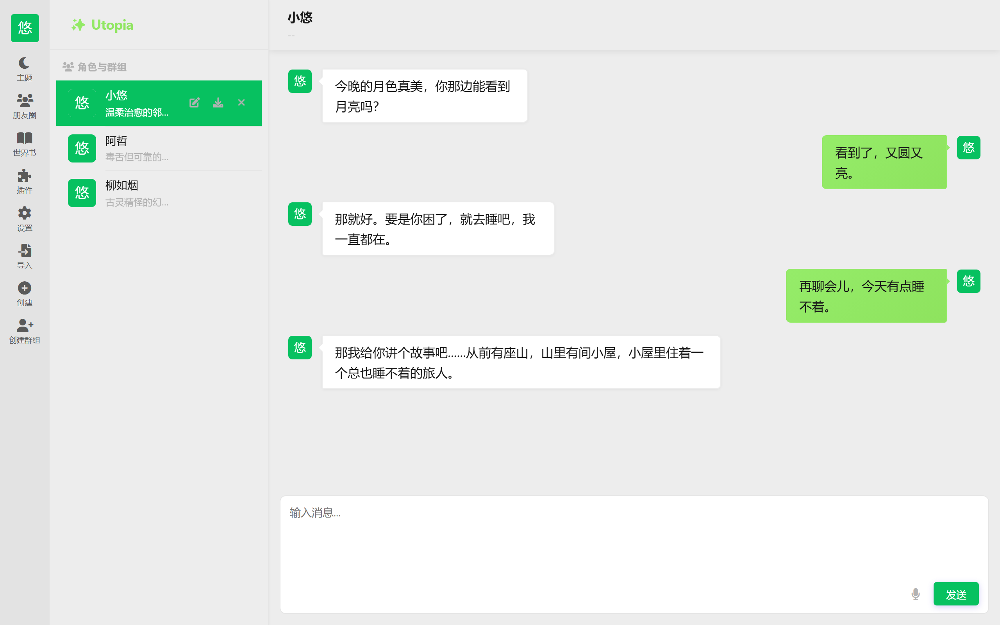
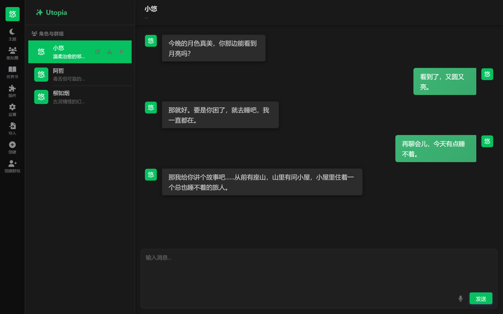
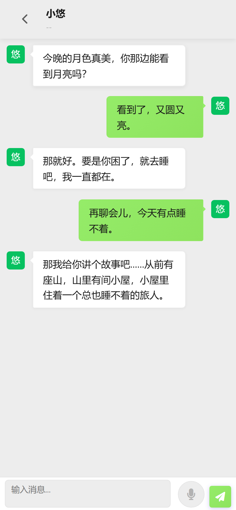

# Utopia

> AI 角色扮演 Agent —— 一个让角色"活起来"的工具集。

[](LICENSE)
[]()
[](https://github.com/404NotFoundObject/utopia/issues)
[](https://404NotFoundObject.github.io/utopia/)

> [!IMPORTANT]
> **在线体验说明**
> 受限于模型文件体积与网络加载速度，在线 Demo 仅展示 UI 与核心交互逻辑，**不提供语义向量（长期记忆检索/联想）支持**。
> 如需体验完整功能，请参考下方「快速开始」在本地运行。

🔗 **在线体验（精简版）：** [https://404NotFoundObject.github.io/utopia/](https://404NotFoundObject.github.io/utopia/)

<p align="center">
  
</p>
<p align="center">
  <em>亮色主题 ⇄ 微信主题一键切换，朋友圈 / 世界书即点即用。</em>
</p>

<p align="center">
  
</p>
<p align="center">
  <em>凌晨 00:31，她睡着了。但你叫醒她，她还是会迷迷糊糊地回你。</em>
</p>

---

## 什么是 Utopia

Utopia 是一个**运行在浏览器中的 AI 角色扮演 Agent**。

它不是角色扮演"平台"，也不是"AI 内容生成产品"。**它是一套工具**——把角色扮演中最难处理的部分（情感、身体、时间、记忆、规则）做好封装，让创作者专注于角色的**性格**和**人设**。

你可以把它理解成 **AI 角色扮演的 IDE**：

- 提供完整的工具链，但不规定你写什么
- 提供样板和建议，但不限制你的选择
- 不绑定模型厂商，可接入任何 OpenAI 兼容端点

所有数据存储在浏览器本地 IndexedDB 中，不上传任何服务器。

---

## 设计哲学

> **复杂的部分我们做，剩下的交给用户。**

几乎所有 AI 角色扮演工具，都把"让角色活起来"这件事交给用户自己解决——用提示词模拟情绪、用正则控制状态、用插件扩展能力。

Utopia 选择另一条路：**把底层引擎内置**。

| 你不需要操心 | 你只需要操心 |
|---|---|
| 角色会不会疲劳、会不会生病 | 角色的性格是什么样的 |
| 时间和季节对情绪的影响 | 角色和用户的关系是什么 |
| 多轮对话中记忆会不会丢失 | 角色说话的语气是什么 |
| 复杂的嵌套规则怎么写 | 角色该出现在什么场景 |
| Token 预算该怎么分配 | 角色该说什么 |

当然，如果你更愿意**手动控制**这些，Utopia **不会阻止你**——所有引擎都可以独立关闭，世界书允许你直接操作底层提示词，插件系统允许你替换任何组件。

**Utopia 的立场是"提供工具"，不是"规定做法"。**

---

## 核心特性

### 🎭 三引擎驱动

角色的回复不只是提示词驱动的结果，而是**情感状态 × 身体状态 × 时间感知**共同作用的结果。角色会因为熬夜变困、因为被夸奖变开心、因为长时间冷落变失落。

- **情感引擎**：六维情绪（愉悦 / 唤醒 / 支配 / 关注 / 意外 / 精力）+ 五类需求（安全 / 尊重 / 归属 / 自主 / 愉悦）+ 三类关系（好感 / 信任 / 亲密）
- **身体状态引擎**：精力、睡意、健康、睡眠周期、疾病、受伤、意识状态
- **时间引擎**：游戏时间 1x ~ 48x 可调，离线自动推进

三引擎相互影响，形成闭环。任一引擎可独立关闭。

#### 情感感知：三层级联识别

角色理解用户说了什么，靠的不是关键词表，而是三层证据的级联裁定：

| 层 | 负责 | 说明 |
|---|---|---|
| 规则层 | 结构 | 子句切分、否定（支持双重否定）、施事与受体识别、极性冲突检测 |
| 语义层 | 覆盖 | 原型句向量 kNN，命中词表之外的表达，复用本地向量模型 |
| LLM 仲裁 | 仲裁 | 仅在前两层证据冲突时介入，不是每条消息都调用 |

**规则层对语义层有一票否决权。** 向量模型对 `我爱你` 与 `我不爱你` 的余弦相似度极高，语义相似度天然对否定不可靠。因此否定和第三方施事这类由语法结构决定的信息，只由规则层定音——`我不喜欢你` 判为拒绝而非亲密，`他喜欢你` 判为第三方示好而非亲密。

共 18 类事件，每类配有独立的情绪影响向量（六维情绪、五类需求、三类关系的变化量），并按角色性格参数加权。

配套**可视化调试面板**（设置 → 引擎，或命令行 `/emotion`），可查看任一输入的切分、命中、否定与施事标注、两层得分与融合权重。

### 🧠 三层记忆

- **全文检索**：MiniSearch 关键词匹配
- **语义检索**：本地向量模型（Transformers.js），支持中英文
- **对话摘要**：AI 自动总结，保持长期一致性

无需外部 API，全部本地运行。支持 `keyword` / `semantic` / `hybrid` 三种检索模式。

> ⚠️ **语义检索需先准备模型文件**：模型体积较大（约 80–235 MB）且不入库。全新克隆后 `lib/models/` 里没有模型，语义层会静默降级为全文检索。运行 `node tools/fetch-model.mjs` 一键把 ONNX 落到 `lib/models/`，或在设置里点「下载模型」（浏览器端缓存，重启后建议用脚本落盘）即可激活。

### 📖 世界书系统 v2.0

动态规则注入系统。支持条件触发、常驻注入、语义触发、粘性规则；支持 AND / OR / NOT 嵌套；支持规则组、规则链、互斥组；支持宏模板与概率触发。

**提供可视化条件编辑器**——不用写复杂表达式，点击配置即可。

支持语义触发：用一句自然语言描述触发场景，系统根据用户消息的**语义相似度**自动匹配。

<p align="center">
  
</p>
<p align="center">
  <em>语义触发 + 实时测试匹配。输入测试文本，立刻看到匹配分数与阈值对比。</em>
</p>

### 👥 群聊

多角色同屏对话。支持 @ 提及、@ 触发回复链、LLM 裁决发言、自主发言轮询。内置三重防循环保险（深度限制 + 回复去重 + 自我排除）。

<p align="center">
  
</p>
<p align="center">
  <em>3 个角色，3 种性格。毒舌的凌川、迷糊的柳如烟、插科打诨的用户——每个人都在"演"。</em>
</p>

### 移动端支持

<p align="center">
  
</p>
<p align="center">
  <em>不止PC，响应式WEB支持绝大多数的设备</em>
</p>

### 💬 微信主题（实验）

一键切换成微信观感——桌面端侧栏变左侧图标栏、输入区带描边外框与「发送」按钮，移动端变「列表 → 对话」两层视图。微信式气泡尾巴、方头像、绿白气泡，细节高度还原。

<p align="center">
  
</p>
<p align="center">
  <em>桌面端浅色：左侧图标栏 + 用户头像，微信式气泡与输入区。</em>
</p>

<p align="center">
  
</p>
<p align="center">
  <em>桌面端暗色：微信暗色观感，同样的布局与交互。</em>
</p>

<p align="center">
  
</p>
<p align="center">
  <em>移动端：全屏对话页，返回按钮 + 底部 dock。</em>
</p>

### 📞 语音

- **TTS**：Web Speech API / Kokoro / OpenAI 兼容 API
- **STT**：Web Speech API / HTTP Whisper
- **语音通话**：状态机驱动的半自动对话，含字幕和悬浮球

### 🧩 插件系统 v1.0

Worker 隔离、钩子系统（before / after / error）、UI 槽位系统、方法级权限声明。插件崩溃不影响主应用。

### 🧪 自动化测试

- **Vitest**：26 个文件 / 521 个用例，覆盖纯逻辑单元、DOM 组件（含 XSS 转义）、存储与引擎集成
- **Playwright E2E**：覆盖应用冷启动、数据库 schema 恢复、情绪识别接线、微信主题，在真实浏览器中验证桌面与移动两个视口
- 见 [TESTING.md](TESTING.md)

```bash
npm install      # 首次运行需安装测试依赖
npm test         # Vitest，约 10s
npm run test:e2e # Playwright，约 4min（首次需 npx playwright install chromium）
```

### 🎨 其他

- **朋友圈**：角色和用户可发布动态，AI 自动互动
- **主题系统**：5 套内置主题（亮色 / 暗色 / 赛博朋克 / 微信 / 微信暗色）+ 自定义主题制作器
- **PWA**：可安装到桌面 / 手机主屏当独立应用使用；静态资源缓存 + 离线应用壳，断网也能打开界面
- **命令行**：20+ 命令覆盖环境查看、时间控制、记忆管理、角色切换
- **多厂商 API**：OpenAI / Anthropic / Google Gemini / Cohere / DeepSeek / Mistral / Groq / Perplexity / xAI
- **角色卡兼容**：Utopia v3.1 / SillyTavern v2/v3（含 PNG 卡）/ Character.AI / 通用格式
- **主动对话**：角色长时间未互动且清醒时自动联系
- **开发者监控**：实时观测引擎事件与 API 请求

---

## 快速开始

### 前置条件

- 现代浏览器（Chrome / Edge / Firefox / Safari）
- 一个 AI 模型的 API Key（OpenAI / Anthropic / 或任意 OpenAI 兼容端点）

### 运行

Utopia 是纯前端应用，无需构建：

```bash
git clone https://github.com/404NotFoundObject/utopia.git
cd utopia

# 用任意静态服务器托管，例如：
python -m http.server 8080
# 或
npx serve
```

打开 `http://localhost:8080`。

> ⚠️ **不要直接双击 `index.html` 打开**。由于使用了 ES Modules 和 IndexedDB，`file://` 协议会导致部分功能失效。必须通过 HTTP 服务器访问。

### 首次配置

1. 打开 **设置 → API 配置**
2. 选择厂商（或选择 OpenAI 并填入本地推理引擎的 Base URL）
3. 填写 API Key
4. 点击"获取模型列表"或手动填写模型名称
5. 保存

### 创建第一个角色

1. 点击侧栏 **导入**（从现有角色卡导入）或 **创建**（从零开始）
2. 填写角色名称、简介、性格描述
3. 保存后点击角色卡片开始对话

> 💡 **提示**：点击 **设置 → 📖 使用指南** 查看完整功能说明。

---

## 使用指南

Utopia 内置完整的交互式文档：

- **应用内**：设置 → 📖 使用指南
- **世界书教程**：侧栏 → 世界书 → 📖 教程
- **命令行**：在输入框输入 `/help` 查看所有命令
- **调试**：在输入框输入 `/inspect` 查看当前生效的规则和 Token 预算
- **情绪识别调试**：设置 → 引擎 → 打开调试面板，或输入 `/emotion`
- **常见问题**：见 [FAQ.md](FAQ.md)

---

## 更新记录

完整版本历史见 [CHANGELOG.md](CHANGELOG.md)。

### v3.9.7

**移动端微信主题的群聊体验收尾：消息布局对齐微信、顶栏居中、会话操作收进「···」菜单；修复群聊二次进入无响应与两处气泡缺陷。**

- **修复「返回后再进同一个群没反应」**：状态更新对相同值不通知订阅者，从对话页返回列表层时当前群 id 没清空，再点同一个群被判为无变化，页面切不过去（得先随便进个单聊再出来）。补上与单聊同样的置空防呆，群聊的返回手势/返回键也随之生效
- **消息布局改为微信式**：气泡原本落在头像正下方、与昵称错位。现在是「头像 +（昵称 / 气泡）」并排，昵称与头像顶部对齐，气泡紧贴其下方，尖角尾巴指向头像中部
- **会话操作收进聊天页「···」**：移动端列表卡片不再挂编辑 / 导出 / 删除按钮（群聊为群设置），统一放在对话页右上角菜单里；群名去掉 👥 前缀
- **顶栏**：会话名相对整条顶栏横向居中，去掉人物关系 / 群人数行
- **修复短消息被压成一字一行**：气泡的宽度百分比原本相对「内容自适应宽度」的祖先解析，行宽先按内容算、再被百分比钳回内容宽以下。改为定宽列后恢复
- **修复深色主题气泡尾巴丢失**：尾巴的形状声明只写在浅色主题下，深色只覆盖颜色——没有 `content` 的伪元素不存在，尾巴整条消失。形状改为两个主题共用

详见 [CHANGELOG.md](CHANGELOG.md)。

### v3.9.6

**移动端返回手势与安全区适配、朋友圈交互对齐微信；修复离线长跨度下的睡眠债建模与两处实机不可用。**

- **返回手势 / 返回键**：此前在 PWA 里按返回会直接退到桌面，只能点顶部返回按钮。新增基于历史记录的视图栈，模态二级页（朋友圈、设置、世界书…）与微信聊天页各占一条记录，返回键逐级返回；顶部按钮行为不变
- **安全区适配**：补上缺失的 `viewport-fit=cover`。朋友圈背景图铺进状态栏（与微信一致），顶栏按钮与标题按安全区下移；底部导航栏贴合屏幕底缘，消除缝隙
- **朋友圈交互对齐微信**：去掉顶部「+ 发布」按钮与白色标题条；**相机按钮改为发表动态**；**点击背景图区域更换封面**
- **去掉机械文案**：AI 生成失败时不再往朋友圈里塞「哈哈哈，有趣！」「今天心情不错」这类兜底句，改为直接跳过（宁缺毋滥）
- **修复长离线后的状态异常**：好几天不打开再上线，角色会一直昏睡并莫名其妙生病。根因是「困倦」状态没有入睡通道（必须先昏厥才能睡觉），且离线补偿一次性套用整段时间、睡眠债直接顶满。现在按游戏小时分段推进，并按昼夜节律自然入睡与醒来
- **修复 `/print` 记忆条目数恒为 0**：拿检索函数当计数器，空查询必然返回 0
- **修复 `/undo` 恒提示「正在生成回复」**：命令只能在发送流程内部执行，处理器里再查 `sending` 恒为真，永远自挡
- **修复群聊发消息报错**：`getGroupMembers is not defined`（纯再导出语法不在本模块创建绑定），群聊第一条消息就发不出
- **`/status` 现在可以改数值**：`/status health 90`、`/status health +5`、`/status valence =-50`，群聊支持 `/status @成员 字段 值`，覆盖 25 个数值字段
- **内部**：PNG 角色卡解码的两份实现收敛为一份（已漂移，且应用实际走的那份没被测试覆盖）；新增端到端真实链路测试

详见 [CHANGELOG.md](CHANGELOG.md)。

### v3.9.5

**世界心跳与版本子系统落地；微信主题样式按需加载；修复数据库自愈自阻塞。**

- **世界心跳**：收敛散落的三条定时器为 `js/core/worldTick.js` 单一 1s 心跳。修复后台 tick 不顺延的问题——此前切走标签页再回来，世界里的时间是停的，现在回前台立即补跑
- **版本子系统**：新增 `version.json` 独立版本通道 + 运行期唯一真源 `appMeta.js`，配合 `updateChecker.js` 定期检查，发现新版本会主动清 Service Worker 缓存并重载（此前用户会长期停在旧应用壳上）。设置页新增「关于」面板，可查看版本与最后检查时间、手动检查更新、清除缓存重载
- **微信主题性能**：`wechat.css` 由常驻加载改为激活时注入、停用时移除，非微信主题不再参与样式匹配；注入期禁用全站过渡 + 启动等待样式表就绪，消除按需加载带来的整页背景闪烁；Service Worker 补上显式预缓存，保证离线切微信主题不缺样式
- **朋友圈视觉**：移除头部「🌐 朋友圈」标题（顶栏标题独立注入，不受影响）；帖子区域容器统一为与帖子相同的背景色，消除帖子上下灰色空白与白卡的割裂
- **修复数据库自愈自阻塞**：旧库缺表时，自愈关闭连接后立即以更高版本重开，却因只读事务未提交而连接仍在占位，把自己阻塞 → 旧逻辑立即失败并弹出「删除所有数据重建」的不可恢复提示。现在改为等事务提交后再关连接，`onblocked` 视为可恢复中间态（等待 + 超时兜底），单例连接主动响应 `onversionchange`
- **修复插件模块链初始化缺陷**：`pluginApi` 与 `modules/index` 互为循环依赖的一环，直接以任一者作为入口导入会崩溃（TDZ / `Object.keys(undefined)`）。改为惰性装载，现在任意入口顺序都免疫（浏览器入口原本安全，属排雷）
- **其他**：关于面板移除内部实现说明、检查时间补齐秒并合为一行；使用指南同步至当前版本；新增发布脚本 `scripts/release.mjs`，一处输入版本号同步四处副本（此前手工改必然漏改）

详见 [CHANGELOG.md](CHANGELOG.md)。

### v3.9.4

**朋友圈界面第二轮对齐微信；内部重复实现收敛。**

- **朋友圈**：点赞与评论合并进同一个灰底容器（白线分隔，无内容时不渲染）；评论文案改微信格式「名字: 内容」「A 回复 B: 内容」（原全角冒号且回复缺空格），作者名改链接蓝；「···」改两枚小圆点、菜单向上弹出；图片按微信规则排版——单图大图保持比例、4 图 2×2、其余九宫格；「评论」可在容器尚不存在时动态创建，不再点了没反应
- **内部重构**（无用户可见行为变化）：余弦相似度 3 份合一（`js/core/vectorMath.js`）、路径取值 2 份合一（`lib/pathUtils.js`）、群成员查询 2 份合一（`js/modules/groupMembers.js`）、角色更新锁改用 `db.withKeyLock`；新增 27 例测试，四项均做过反向验证

详见 [CHANGELOG.md](CHANGELOG.md)。

### v3.9.3

**新增睡眠债建模，朋友圈交互微信化重构，审计遗留项清零。**

- **睡眠债**：清醒按「每日睡眠需求 ÷ 24」持续累积缺觉、睡眠按「时长 × 睡眠质量」偿还（午休 80%），影响睡意增速、精力消耗与健康衰减；**长期不睡会生病**首次真正生效（欠债超需求 1.5 倍独立触发判定，此前只看 `health < 50`）；激活 `totalSleepHours` / `lastNapDate` / `dreamContent` 三个死字段，新增可选的 AI 梦境生成（默认关闭）
- **朋友圈**：修复回复不显示回复对象、角色只肯回一次、回复某条回复无人接话三个问题，新增点赞；界面按微信重构——方形圆角头像、蓝色昵称、相对时间、「···」赞评菜单、灰底点赞行与评论区，点击评论/回复行直接回复
- **数据完整性**：备份补齐 lastMode / lastCharacterId / lastGroupId 与插件 VFS，新增版本头与导入前校验，并补上此前缺失的导入恢复路径（原来只能导出不能恢复）
- **其他**：原生角色卡往返不再静默重掷性格、记忆预算按条目而非按行裁剪、`eventBus.off` 语义回归与 `once` 误删修复、粘性事件支持通配符订阅与参数快照、`pluginDragDrop.destroy()` 不再抛错、`server.py` 按 Ctrl+C 不再卡死（自死锁）

详见 [CHANGELOG.md](CHANGELOG.md)。

### v3.9.2

数据库主键错配迁移改为同一 versionchange 事务内原子写回、失败回滚不丢数据；SillyTavern PNG 卡端到端断链与中文 base64 乱码修复；情感衰减高倍速符号翻转改解析解；朋友圈社交内容生成由写死的通用助手改为注入完整角色人设（发帖/评论/回复不再是预设文案）、评论数随机到 0 不再导致角色从不评论、全局每日上限计数改跨角色累加、调度持久化改用主键写入；SSE CRLF 事件边界、Google 流式 `alt=sse`、Cohere v2 迁移；朋友圈回流接入群聊/通话/自主对话、情感回路三路径闭合。详见 [CHANGELOG.md](CHANGELOG.md)。

### v3.9.1

完整代码审计后的系统性修复：插件权限绕过、SillyTavern PNG 卡双向兼容、Google/Cohere 适配器空回复、SSE CRLF 静默空回复、情感衰减高倍速符号翻转、角色卡丢字段、数据库记录级迁移、朋友圈开关与回流、群聊记忆污染等，共 40+ 项安全 / 数据完整性 / 正确性 / 健壮性修复。同步实机反馈：PWA 离线缓存、移动端键盘行为、微信主题列表行高与朋友圈顶栏。详见 [CHANGELOG.md](CHANGELOG.md)。

### v3.9.0

**新增微信主题（实验功能）。**

- **两套内置主题**：`wechat`（浅色）与 `wechat-dark`（暗色），在「设置 → 外观」的下拉中以「微信 · 实验」提供。走既有主题通路（`THEME_PRESETS` → `applyTheme`），不引入第二套 UI 结构
- **桌面端**：侧栏底部重排为最左侧 64px 垂直图标栏，顶部显示用户头像（取自用户设置，点击打开设置），列表列相应让位；输入区微信化——加高、带描边圆角外框并四周留白、工具行在上，右下角「麦克风 + 绿底发送」同行文字按钮，底色与聊天页一致
- **移动端**：两级视图——`#sidebar` 变为全屏会话列表层，选中会话后进入对话页，对话页头部出现返回按钮；底部 dock 只保留「聊天 / 插件 / 朋友圈 / 设置」四项，其余动作收进列表页右上角「+」深色折叠菜单；朋友圈为全屏页面（封面背景可上传，内容整页上下滚动）
- **朋友圈平台分化**：移动端保持全屏页面，PC 端改为居中悬浮窗（520px 定宽、12px 圆角、内部整页滚动），点击「朋友圈」不再铺满整屏；同时修复亮色 / 暗色 / 赛博朋克主题下朋友圈布局错乱（封面改为仅微信主题注入，切回其他主题自动清除）
- **PWA**：新增 `manifest.json` + Service Worker（静态资源 stale-while-revalidate、离线应用壳、跨域与写请求不拦截），配套 192 / 512 / maskable 三档图标，可安装为独立应用
- **观感细节**：聊天顶栏只显示名称、微信式气泡尾巴（靠头像侧尖角）、方形圆角头像（含群聊）、气泡宽度收窄至 72%、气泡内不显示时间、微信品牌绿 `#07C160` 与配套灰阶/红色系
- **零侵入**：纯增量实现，未修改 `chatUI.js` / `sidebar.js` / `save.js`；切回其他主题不残留任何状态

### v3.8.0

**情感感知引擎重写 + 自动化测试模块。**

- **情感感知改为三层级联**：规则层（否定 / 施事 / 受体 / 极性冲突）+ 语义层（原型句向量）+ LLM 仲裁（仅证据冲突时触发）
- **事件类别 12 → 18**：新增拒绝疏离、第三方示好、安抚澄清、感谢、抱怨、调侃，每类配有独立情绪影响向量
- **新增情绪识别调试面板**：可查看任一输入的切分、命中与结构标注、两层得分与融合权重
- **数据库 schema 自愈**：缺表 / 缺索引自动补齐且不丢数据；主键结构不兼容时给出可读提示
- **新增测试模块**：Vitest 440 个用例 + Playwright E2E 套件
- **稳定性**：网络时间请求增加超时上限；启动失败提示携带真实原因

### v3.7.1

首次开源发布。三引擎、三层记忆、世界书 v2.0、群聊、语音、插件系统等完整能力。

---

## 项目结构

```
utopia/
├── index.html                    # 主入口
├── LICENSE                       # Apache License 2.0
├── NOTICE                        # 版权与归因声明
├── README.md                     # 本文档
├── CHANGELOG.md                  # 版本更新记录
├── TESTING.md                    # 测试指南
├── FAQ.md                        # 常见问题
│
├── css/                          # 样式
├── js/                           # 应用代码
│   ├── app.js                    # 应用入口
│   ├── core/                     # 核心基础设施
│   ├── modules/                  # 业务模块
│   ├── plugins/                  # 插件系统
│   ├── services/                 # TTS / STT
│   ├── ui/                       # 界面层
│   ├── utils/                    # 工具函数
│   └── dev/                      # 开发工具
│
├── tests/                        # 测试
│   ├── unit/                     # 纯逻辑单元测试
│   ├── dom/                      # DOM 组件测试
│   ├── integration/              # 存储与引擎集成测试
│   ├── e2e/                      # Playwright 端到端测试
│   ├── setup/                    # Vitest 全局前置
│   └── helpers/                  # DOM 骨架与测试夹具
│
└── lib/                          # 打包的第三方库
    ├── transformers.min.js       # Transformers.js
    ├── ort/                      # ONNX Runtime Web
    ├── api-adapter/              # API 适配器
    ├── context-injector/         # 上下文注入器
    └── event-bus/                # 事件总线
```

---

## 技术栈

| 分类 | 依赖 | 用途 |
|------|------|------|
| 运行环境 | 现代浏览器 | 纯前端，无后端 |
| 数据存储 | IndexedDB | 完全本地 |
| 语义引擎 | Transformers.js + ONNX Runtime Web | 本地向量推理 |
| 全文检索 | MiniSearch | 关键词匹配 |
| Markdown | Marked + DOMPurify | 渲染与 XSS 防御 |
| ZIP 解压 | fflate | 插件安装 |
| 图标 | Font Awesome Free | UI 图标 |
| 测试（开发依赖） | Vitest + jsdom + fake-indexeddb | 单元 / DOM / 集成测试 |
| 测试（开发依赖） | Playwright | 端到端测试 |

**运行时无构建工具，无 Node.js 依赖，无前端框架。** 测试依赖仅在开发时使用，不影响应用运行。

---

## 设计取舍

Utopia 的一些决策是**有意为之**的取舍，不是缺陷：

### 1. 基础注入不进入 Token 预算

角色的系统提示词、身份锁定、一致性约束、用户信息、时间上下文——这些由 `injector.js` 全量发送，不参与剪裁。

**理由**：这些是角色的核心定义，剪裁会导致人设漂移。如果它们撑爆上下文窗口，API 会直接报错——这是用户输入问题，程序不替用户做决定。

### 2. 不提供官方角色库

Utopia 是工具，不是内容平台。角色卡由用户自行创建和分享，官方仅提供少量样板角色作为教程示例。

### 3. 不组织用户社区

用户聚集的地方自然会出现社区（贴吧、B站、Discord 等）。Utopia 的职责是保证**导出的东西别人能导入**、**做出来的工具别人能用**——社区的组织不需要官方介入。

### 4. 不内置图片生成

Utopia 专注于对话与角色行为，图片生成不在规划内。如有需要可通过插件接入外部图像生成服务。

### 5. 插件不支持裸模块导入

插件运行在 Blob URL 的 Worker 中，无法解析 importmap。平台已通过 `self.api` 提供所有核心能力的访问接口，插件应为自包含。

使用裸模块的插件会加载失败，这是**设计边界**，不是平台 BUG。

---

## 贡献

Utopia 目前是一个**个人项目**，处于冷启动阶段。欢迎各种形式的参与：

- **报告 bug**：提交 issue，附上复现步骤、浏览器版本、控制台日志
- **提出建议**：功能请求、UX 改进、文档修正
- **提交代码**：Pull Request 前请先开 issue 讨论方向
- **分享角色卡**：使用 Utopia 导出的角色卡，欢迎在社区分享
- **撰写教程**：使用经验、世界书技巧、插件开发笔记

详见 [CONTRIBUTING.md](CONTRIBUTING.md)。

---

## 许可

Utopia is licensed under the [Apache License 2.0](LICENSE).

You are free to use, modify, and distribute this software, including for commercial purposes, provided that you retain the copyright notice and license text as required by the license.

See [NOTICE](NOTICE) for attribution details, and [THIRD_PARTY_NOTICES.md](THIRD_PARTY_NOTICES.md) for third-party software licenses.

---

## 作者

Utopia 由 **404** 创建和维护。

- GitHub: [@404NotFoundObject](https://github.com/404NotFoundObject)
- Email: 3526433323@qq.com

---

**Utopia** · 永远的理想国
